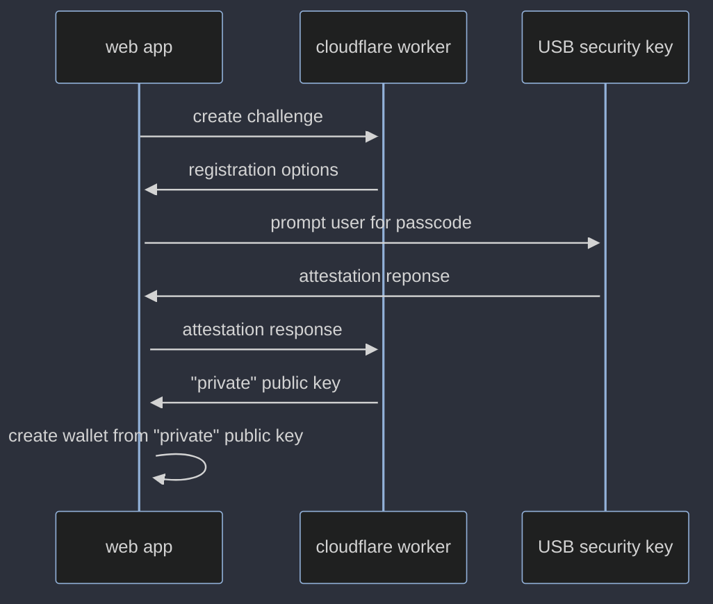

# usb-security-key-to-evm-wallet
use a [yubico](https://www.yubico.com/) USB security key to sign a user in to an application, and generate an EVM wallet to use in applications

## aside
- code should be open sourced to ensure public key is not read anywhere, as it is used to generated a private key 

## why
having something 'on you' (e.g. on a chain or keyset) as being owned can have more feelings of ownership versus having shards of your private key stored in the cloud, "somewhere"

## uses
- can be used in applications where wallets are indexed with assets
- applications without gas, or, can be combined with flows to top up wallets from external wallets
- etc.

## flow

### todo
- ensure flow solves for uniqueness of userID as to not override other users signing in with a username

## imagination
- tarot applications with minting to wallet using a relayer that doesn't require wallet gas

